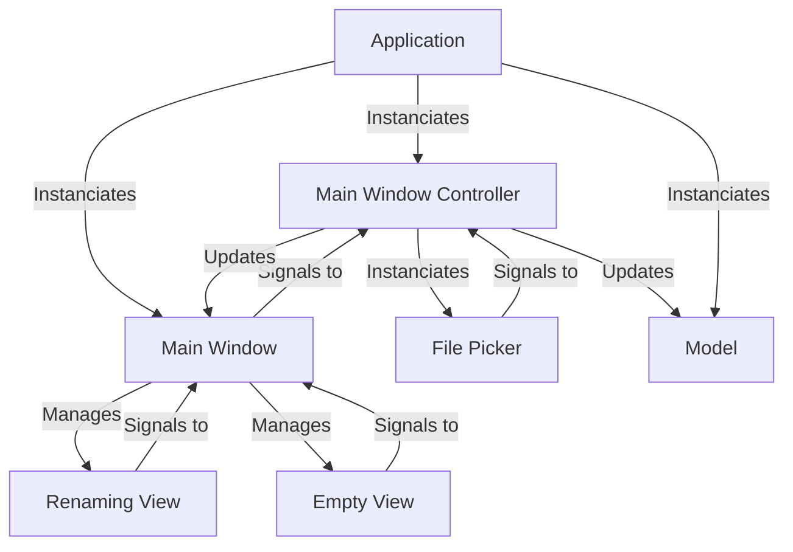

```mermaid
graph TD;

app["Application"]
window["Main Window"]
controller["Main Window Controller"]
rename["Renaming View"]
empty["Empty View"]
picker["File Picker"]
model["Model"]

controller -- Updates --> model
app -- Instanciates --> controller
app -- Instanciates ---> window
app -- Instanciates --> model
window -- Manages --> rename
rename -- Signals to --> window
controller -- Instanciates --> picker
picker -- Signals to --> controller
window -- Signals to --> controller
controller -- Updates --> window
empty -- Signals to --> window
window -- Manages --> empty
```